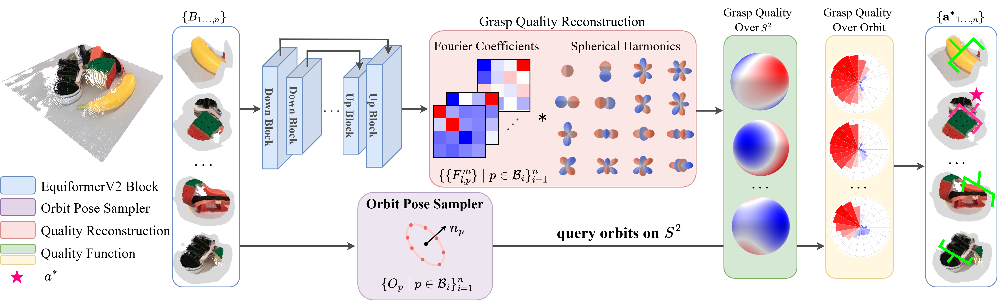

# OrbitGrasp: SE(3)-Equivariant Grasp Learning

[Project Website](https://orbitgrasp.github.io/) | [Paper](https://arxiv.org/pdf/2407.03531) | [Video](https://youtu.be/Y3UxZMPc0ms?si=eIActXwoWYY4vNup)  
<span class="author-block">
<a href="https://bocehu.github.io/">Boce Hu</a><sup>1</sup>,
</span>
<span class="author-block">
<a href="https://zxp-s-works.github.io/">Xupeng Zhu</a><sup>*1</sup>,
</span>
<span class="author-block">
<a href="https://www.dianwang.io/">Dian Wang</a><sup>*1</sup>,
</span>
<span class="author-block">
<a href="https://www.linkedin.com/in/zihao-dong-321712212/">Zihao Dong</a><sup>*1</sup>,
</span>
<span class="author-block">
<a href="https://haojhuang.github.io/">Haojie Huang</a><sup>*1</sup>,
</span>
<span class="author-block">
<a href="https://www.linkedin.com/in/chenghao-wang-01a036203/">Chenghao Wang</a><sup>*1</sup>,
</span>
<span class="author-block">
<a href="https://www.robinwalters.com/">Robin Walters</a><sup>1</sup>,
</span>
<span class="author-block">
<a href="https://helpinghandslab.netlify.app/people/">Robert Platt</a><sup>1 2</sup>
</span>

<sup>1</sup>Northeastern Univeristy, <sup>2</sup>Boston Dynamics AI Institute  
Conference on Robot Learning 2024



## Installation

1. Install [Mambaforge](https://github.com/conda-forge/miniforge#mambaforge) or Anaconda
2. Clone this repo
    ```bash
    git clone git@github.com:BoceHu/orbitgrasp.git
    cd orbitgrasp
    ```
3. Install environment:
   Use Mambaforge (recommended):
    ```bash
    mamba env create -f conda_environment.yaml
    conda activate orbitgrasp
    ```
   or use Anaconda:
    ```bash
    conda env create -f conda_environment.yaml
    conda activate orbitgrasp
    ```
   This procedure will take around 10 minutes to install all dependencies.(Since the torch cluster, geometric, and
   scatter are not available in the conda-forge channel, we need to install it from the source code, which may take a
   while.)


4. Check
   the  [Segment Anything](https://github.com/facebookresearch/segment-anything?tab=readme-ov-file#model-checkpoints)
   website to download the checkpoint.
   In our implementation, we use the vit-h as the backbone, and the checkpoint is
   available [here](https://dl.fbaipublicfiles.com/segment_anything/sam_vit_h_4b8939.pth).
   Move the downloaded checkpoint to the `./pretrained` folder.

## Dataset

We have two camera settings and two ways to collect the data. The camera settings are `single` and `multi`, and two ways
are w/ mask and w/o mask.

For data collection w/ mask:
To accelerate the data collection speed by multi-processing, we first use SAM to generate and save masks of all scenes
and then directly use them for later data collection. (Thus, we don't need to load SAM in each data collection
process.)

1. The scene can be changed to `pile` or `packed`. And the sample_num indicates the num of scenes.

   e.g., (this is for single camera setting)
   ```bash
    python ./dataset/generate_raw_pose_mask_single.py --scene='pile' --sample_num=2500
   ```
   If you want to use the multi-camera setting, you can use the following command:
   ```bash
    python ./dataset/generate_raw_pose_mask_multi.py --scene='pile' --sample_num=800
   ```
   This procedure can be ignored if you don't need masks to generate grasp poses. Here, masks are used to provide
   semantic and object-centric information for the grasp pose generation.

2. After generating the masks, you can start to collect the data. The scene can be changed to `pile` or `packed`.
   `from_save=True` indicates that we use the saved masks for data collection (Since we save the environment config in
   the last step, we can generate exactly the same scene as the scene used for generating masks).
   `start_scene` indicates the starting scene number from saved envs, and `iteration_num` indicates the number of scenes
   to generate grasp poses.

   e.g., if `start_scene=100` and `iteration_num=40`, the scenes generated will be from 100 to 140.
   ```bash
    python ./dataset/generate_pose_single.py --scene='pile' --from_save=True --GUI=False --start_scene=0 --iteration_num=40
   ```
   If you want to use the multi-camera setting, you can use the following command:
   ```bash
    python ./dataset/generate_pose_multi.py --scene='pile' --from_save=True --GUI=False --start_scene=0 --iteration_num=40
   ```
   If you want to use the data collection w/o mask, you can use the following command:
   ```bash
    python ./dataset/generate_pose_single_wo_mask.py --scene='pile' --GUI=False --start_scene=0 --iteration_num=40
   ```

   To accelerate this procedure, you can open multiple terminals and run the same file (with different `start_scene`) in
   each terminal to collect data in parallel.
   For example,
    ```bash
     python ./dataset/generate_pose_single.py --scene='pile' --from_save=True --GUI=False --start_scene=0 --iteration_num=50
    ```
   ...
    ```bash
     python ./dataset/generate_pose_single.py --scene='pile' --from_save=True --GUI=False --start_scene=1000 --iteration_num=50
    ``` 

   In our implementation, we used 20 processes to collect data in parallel.

3. Filter the dataset to remove unreachable poses.
   ```bash
    python ./dataset/filter_dataset.py --scene='pile' --camera='single'
   ```
4. Split the dataset into train and test sets.
   ```bash
    python ./dataset/split_dataset.py --camera_setting='single' --train_ratio=0.8
   ```
   You can change the saved dir and root dir by `--output_dir` and `--root_dir`.

## Training

Before training, we pre-calculate the harmonics of the test set to avoid repeated calculations during training.
(Since we use data augmentation for the training set, this pre-calculation can only be used for the test set.)

```bash
python ./scripts/save_harmonics.py --camera_setting='single' --use_mask=True
```

Then, you can start to train the model.

```bash
python ./scripts/train_single.py
```

```bash
python ./scripts/train_multi.py
```

The training configuration is saved in `./scripts/single_config.yaml` and `./scripts/multi_config.yaml`.
You can change the training configuration in this file.

## Testing

After training, you can test the model by running the following command.

```bash
python ./scripts/test_grasp_single.py
```

```bash
python ./scripts/test_grasp_multi.py
```

Remember to load the correct checkpoint in the `./scripts/single_config.yaml` and `./scripts/multi_config.yaml`.

## License
This repository is released under the MIT license. See [LICENSE](LICENSE) for additional details.

## Acknowledgement
* Our repo is built upon the [GIGA](https://sites.google.com/view/rpl-giga2021) and [EdgeGrasp](https://haojhuang.github.io/edge_grasp_page/).
